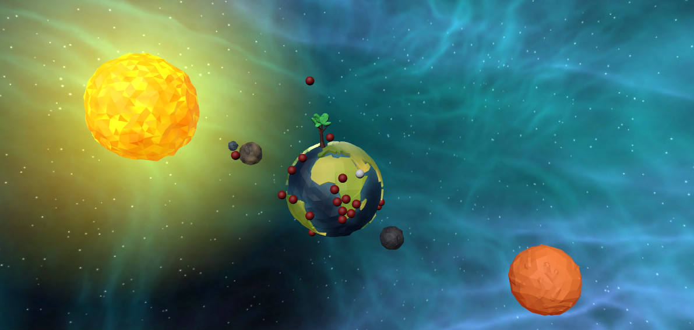

# gravity.js
Gravity WebGL experiment in the Solar System

**Demo** - http://valentinvichnal.com/gravity

## Controls
Now with better movement controls, which are based on the camera view position and not the ball's absolute position.

|              | Button              |
|--------------|---------------------|
| Move    | <kbd>up</kbd> <kbd>left</kbd> <kbd>down</kbd> <kbd>right</kbd>     |
| Move (Secondary)    | <kbd>W</kbd> <kbd>A</kbd> <kbd>S</kbd> <kbd>D</kbd>     |
| Fly | <kbd>spacebar</kbd> |
| Fall | <kbd>CTRL</kbd> |

## Source
- Project: https://playcanvas.com/project/411552/overview/gravity
(Script-Entity connections and Map designs are only available in the PlayCanvas editor and aren't saved in this repo)
- Scripts: /scripts
- Assets, Models: https://playcanvas.com/project/411552/overview/gravity

## Todos
### Minor
- Make the Apple Tree on Earth move with the ground
- Make Apples on Earth move with the ground
- Make Ball on Earth move with the ground

### Major
- Make planets orbit around the Sun
- Make gravitational field for all planets and apply the force to the Apples and Ball if they close

## Credits
### Engine
- PlayCanvas WebGL:
https://playcanvas.com/

### Music:
- Stellardrone - Eternity: https://stellardrone.bandcamp.com/

### Models:
- Low-Poly planets: Christian Dinkelborg, Martin Niehoff
